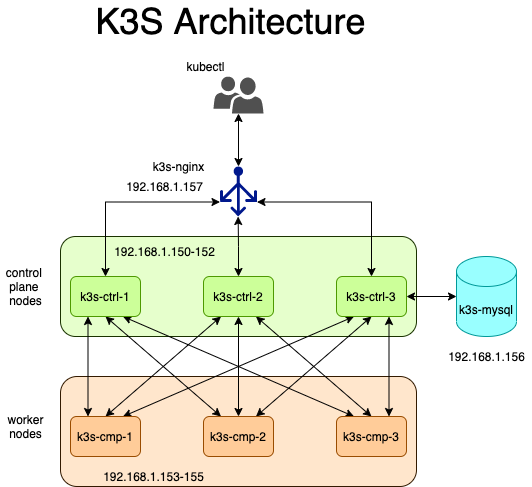

# Why Proxmox VE ? 

Because I can. It's easy to install. It's easy to maintain. It's easy to operate. It's opensource. It forms clusters. So yeah, why not ?

My homelab consist of several Dell servers running Proxmox VE 8. I have a user with proper rights (```terraform-prov```) that I use to automate VM creation. 

I'm constantly testing new Kubernetes flavors, just to be able to study them, search for some specific feature, ...  but each manual deployment takes time (OpenShift ! I'm looking at you). And I don't want both my hypervisors to be running every day, 24x7, so I need a way to deploy my environments automatically, quickly, along with the deployment of the Kubernetes workload. The second part is fairly easy if the kubeconfig points to the right cluster: a nice `kubectl apply -f` and presto, the workload is installed.

But what about the cluster deployment ?

Enter Terraform.  And enter Ansible. And enter Helm (ok, ok, that's a lot entering at once ... let's summarize :)

Enter Infrastructure as Code !

## Architecture




1. My Terraform code deploys 8 nodes : 6 for the K3s cluster, one for a mysql server, and one for a proxy (I'm running K3s in HA mode, with external DB, so check the Rancher doc for exact architecture details). 
2. A bunch of playbooks deploy the services : one for setting up mysql, one for setting up nginx in ha proxy mode, one to deploy the control plane nodes (and download the kubeconfig) , and finally one to deploy the worker nodes. 

| Name | Mac address | IP address | Role |
|------|-------------|------------|------|
| k3s-ctrl-1 | 7A:00:00:00:01:01 | 192.168.1.150 | Control plane #1 |
| k3s-ctrl-2 | 7A:00:00:00:01:02 | 192.168.1.151 | Control plane #2 |
| k3s-ctrl-3 | 7A:00:00:00:01:03 | 192.168.1.152 | Control plane #3 |
| k3s-cmp-1 | 7A:00:00:00:01:04 | 192.168.1.153 | Worker #1 |
| k3s-cmp-2 | 7A:00:00:00:01:05 | 192.168.1.154 | Worker #2 |
| k3s-cmp-3 | 7A:00:00:00:01:06 | 192.168.1.155 | Worker #3 |
| k3s-mysql | 7A:00:00:00:01:07 | 192.168.1.156 | External DB |
| k3s-nginx | 7A:00:00:00:01:08 | 192.168.1.157 | Load balancer |

Each VM is configured with a private Mac address (1st byte : 1st bit (or LSB) : off, 2nd bit : on), I do this to easily sort lab VMs belonging to specifig tests (f.i., my OpenShift lab has addresses in the 7A:..:**02**:xx range). These Mac addresses are then reserved on my DHCP server to provide the lab IP addresses (they're in the file ```ìnventory/hosts.ini```). 

## Template preparation

I'm cloning an existing template (Ubuntu 20.04), where I have a user (ansiblebot) with proper sudo privileges. This is the user that Ansible will use for the ```become``` commands. I haven't done it yet, but I'm planning on removing the sudo privileges for the ansiblebot user as a post install task.

Also installed docker on the box, along with additional tools I use from time to time. I could use two templates, one for the general purpose servers, and one for the cluster. Oh well, that'll do for now. 

I'm cloning this box 8 times, which takes about 1m30s on my R630 (linked clones, not full ones). The name of the template is defined in the terraform variables file. 

BTW, I've tried to make the k3s-mysql and k3s-nginx hosts as LXC containers, but the Telmate terraform provider offers less features for an Ansible-friendly installation (due to the Proxmox API ? dunno... ), so I've decided to make them low power hosts. 

## Commands
The commands are fairly simple :

```
terraform apply -auto-approve
ansible-playbook -i inventory/hosts.ini -u ansiblebot playbook-mysql.yaml playbook-haproxy.yaml playbook-control-plane.yaml playbook-worker.yaml
```

Ansible runs the commands in sequence, because the mysql and the haproxy have to be there before deploying the cluster.

## Fair warning

I'm running terraform in auto-approve mode, which is fine in a home lab, but not in production or in a company lab where deleting resources may harm someone else's work. I do it, because I've been running the `apply` about 20 millions time by now, so I know the effects. Plus, it's a home lab, so if something goes wrong, I'll redo it again. 

And don't get me started on the fact that the db password is in clear in one of the file : yes, I KNOW. It's a lab. This setup is torn down and restarted on a daily basis, sometimes with a random password generated. Use a vault when going to prod ! Never let your password in clear text in prod ! Do I have to tell you everything ???

## Todo

- [ ] A Jenkins pipeline
- [ ] use dynamically assigned IP addresses. Static IPs are for the lazy (plus, it won't work for a cloud deployment)
- [ ] remove sudo privileges to ansiblebot user once provisioning is done
- [ ] go get a coffee. There's never enough coffee on any given day
- [ ] make deployment accross multiple proxmox hosts - should be easy, the target_host could be part of the VM var definition ?
- [ ] convert to a cloud deployment
- [ ] add Rancher as the UI ... not really tempted as I prefer CLI
- [ ] improve the Ansible code. I'm not using variables the Ansible way. Shame on me ...

## Troubleshooting

The DB must be properly configured and avaiable from the control plane nodes. If it's not, then you'll get an error in ```systemctl status k3s``` complaining about connection to the mysql box closed/rejected/... So test the DB access from one of the control-plane nodes : 

First to the mysql server :
```
mysql -u k3s  -h 192.168.1.156  -p -D k3s
```
Then to the HA Proxy :
```
mysql -u k3s  -h 192.168.1.157 --port=33306 -p -D k3s
```

Ports, names, and IPs are the ones configured in my project, adapt these commands to your own config. 

If for some reason the deployment of the control nodes failed, connect to each one of them and run ```/usr/local/bin/k3s-uninstall.sh```, find the root cause of the failure, fix it, and just restart the control plane playbook, followed by the worker node playbook.

